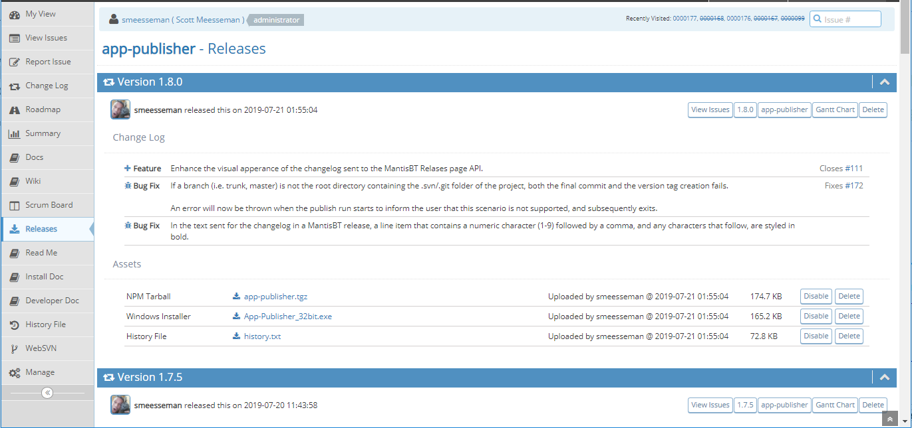

# Releases MantisBT Plugin

- [Releases MantisBT Plugin](#releases-mantisbt-plugin)
  - [Description](#description)
  - [Installation](#installation)
  - [Web Server Configuration](#web-server-configuration)
  - [Configuration](#configuration)
    - [Option - Create Next Versions](#option---create-next-versions)
    - [Option - Remove past unreleased versions](#option---remove-past-unreleased-versions)
    - [Option - Resort Unreleased Versions](#option---resort-unreleased-versions)
    - [Option - Update Target Version for Unresolved Issues](#option---update-target-version-for-unresolved-issues)
  - [REST API](#rest-api)
    - [GET: /plugins/Releases/api/releases/{project}/{id}](#get-pluginsreleasesapireleasesprojectid)
    - [POST: /plugins/Releases/api/releases/{project}](#post-pluginsreleasesapireleasesproject)
    - [PUT: /plugins/Releases/api/releases/{project}/{id}](#put-pluginsreleasesapireleasesprojectid)
    - [DELETE: /plugins/Releases/api/releases/{project}/{id}](#delete-pluginsreleasesapireleasesprojectid)
  - [Screenshots](#screenshots)
    - [Plugin Releases Screen](#plugin-releases-screen)
  - [Jenkins Integration](#jenkins-integration)
  - [Authors of Original Code Base](#authors-of-original-code-base)

## Description

This plugin is a continuation of the legacy `releasemgt` plugin.  It allows user to store releases composed of a changelog and assets (file downloads).  There have been several visual improvements and bug fixes, as well as a new REST API to create releases and upload changelogs with assets.

This plugin was developed and tested on MantisBT 2.21.1.

## Installation

Extract the release archive to the MantisBT installations plugins folder:

    cd /var/www/mantisbt/plugins
    wget -O Releases.zip https://github.com/mantisbt-plugins/Releases/releases/download/v1.0.1/Releases.zip
    unzip Releases.zip
    rm -f Releases.zip

Ensure to use the latest released version number in the download url:  (version badge available via the [ApiExtend Plugin](https://github.com/mantisbt-plugins/ApiExtend))

Install the plugin using the default installation procedure for a MantisBT plugin in `Manage -> Plugins`.

## Web Server Configuration

For Apache configuration, see the example Location directive found in api/apache2-site-config

## Configuration

The *Disk Directory* must be set prior to making any releases, and this directory must exist.  The web server must have write access to this directory.

The following options can be turned on and off in the *Releases* plugin configuration:

1. Create next versions
2. Remove past unreleased versions
3. Resort Unreleased Versions
4. Update Target Version for Unresolved Issues

All four options default to **OFF**.

### Option - Create Next Versions

With this option **ON** when a release is made, the next patch, minor, and major releases will be created if they do not exist already.  TImestamps for the sake of ordering are set as follows:

- Patch 7 days following the current date
- Minor 30 days following the current date
- Major 90 days following the current date

### Option - Remove past unreleased versions

With this option **ON** when a release is made, all previous unreleased versions are removed.  The PHP function *version_compare* is used to determine what is a "previous" release.

### Option - Resort Unreleased Versions

With this option **ON** when a release is made, all unreleased versions will be resorted according to timestamp.

### Option - Update Target Version for Unresolved Issues

With this option **ON** when a release is made, the target version will be updated for all unresolved issues that have their target version set to the released version.  The new target version will be the next minor version, if it exists.  If it does not, the target verison is updated to the next patch, and if that does not exist, to the next major version.

## REST API

This plugin exposes a REST API for creating/uploading releases.  The `Authorization` header value must be set to the API token for authentication in all requests.  The token can be sreated in User Preferences for the user that will be used to make the requests under.

Example header:

    Content-Type = application/json; charset=UTF-8
    Authorization: DvhKlx9_g5dNkBEI4jqVmwAxaN9a1y3P

The following endpoints are available:

### GET: /plugins/Releases/api/releases/{project}/{id}

Not supported in v1.x

### POST: /plugins/Releases/api/releases/{project}

Creates the specified version if it does not already exists.  Assets are attached to created or pre-existing releases.  The "release" is unique to the "version", each release can have only one version and vice versa.  The url part "{project}" is the MantisBT project name, case sensitive.

Request Parameters

|Name|Description|Type|Possible Values|Default Value|Required|
|---|---|---|---|---|---|
|version|The version string i.e. `1.5.14` or `2.1.21`|string|||yes|
|notes|The version notes, or changelog.  Can be text, html, or markup|string|||no|
|notesismd|Set this flag to `1` if the notes field contains markdown|enum|0, 1|0|no|
|assets|File assets|array(object)|||no|
|dryrun|Set this flag to `1` to perform a dry run only|enum|0, 1|0|no|

File asset parameters

|Name|Description|Type|Possible Values|Default Value|Required|
|---|---|---|---|---|---|
|name|The file name|string|||yes|
|data|The file data, base64 encoded|string|||yes|
|desc|The file description|string|||no|
|type|The mime type of the file|string|Valid mime type|application/octet-stream|no|

The `mime-type`, if not provided by the client, will be determined by the plugin.  If a mime type cannot be found, `application/octet-stream` will be used.

Example JSON Request Body

    {
        "version": "1.4.3",
        "notes": ".......",
        "assets": [
        {
            "name": "package.json",
            "data": "VGVzdCB0ZXN....0IHRlc3QgdGVzdA=="
        }]
    }

Example Response Body

    {
        "id": 1432,
        "url": "https://my.domain.com/mantisbt/plugin.php?page=Releases/releases#1.4.3
    }

### PUT: /plugins/Releases/api/releases/{project}/{id}

Not supported in v1.x

### DELETE: /plugins/Releases/api/releases/{project}/{id}

Not supported in v1.x

## Screenshots

### Plugin Releases Screen

## Jenkins Integration

Integrates with the [jenkins-mantisbt](https://github.com/spmeesseman/jenkins-manstisbt) Plugin.

## Authors of Original Code Base

- Vincent Debout <deboutv@free.fr>
  [http://deboutv.free.fr/mantis/plugin.php?plugin=ReleaseMgt](http://deboutv.free.fr/mantis/plugin.php?plugin=ReleaseMgt)
- Jiri Hron <jirka.hron@gmail.com>
  [http://code.google.com/p/mantis-releasemgt/](http://code.google.com/p/mantis-releasemgt/)
